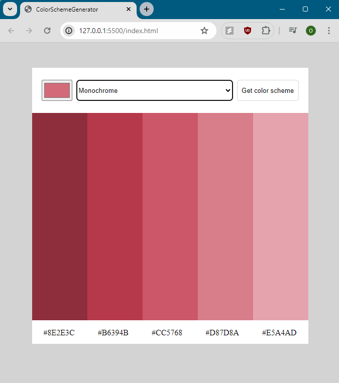

# Color Scheme Generator Webpage

Webpage where you choose a color and style, and are given 5 colors
that fit that selection 

- Webpage takes color and style values, accesses the thecolorapi.com API through the fetch function and uses those values as parameters for data retrieval. 
- Data gotten through the fetch function is converted to a JavaScript object. Values of color are accessed in those objects and used to output color scheme to user.

